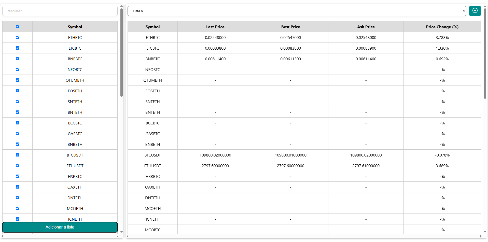
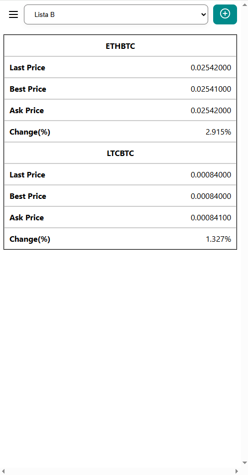
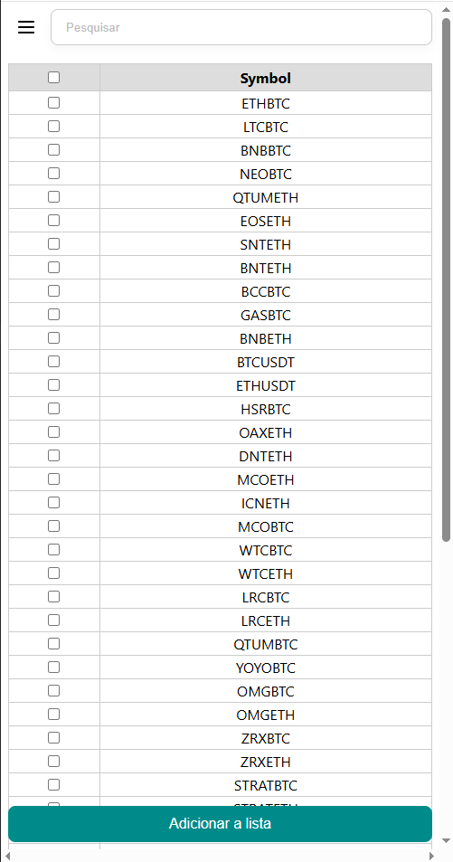

## front-end-binance
Projeto React que consome a API da Binance para listar símbolos e adicioná-los à WatchList.

### Pré-requisitos
   Node.js (versão recomendada: 16 ou superior)
   npm ou yarn

### Instalação
   npm install
### Rodando o projeto
   npm run start

### Rodando os testes
   npm run test

## Telas

### HOME

### Mobile 

### Menu Mobile 

